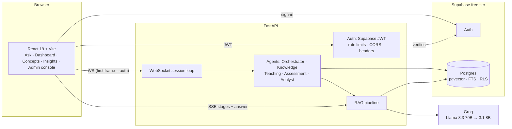

# Architecture

Kiddoo is an adaptive DSA tutor whose answers are **grounded, cited and verified** against a
knowledge base, and whose five agents make learner-level decisions on top of that evidence.
Everything runs on free tiers: Supabase (Postgres + Auth), Groq (LLM), and local open models.

## Layers

| Layer | Choice | Why |
|---|---|---|
| Database | Supabase Postgres | One free, hosted store for relational data, vectors (pgvector HNSW) and full text (GIN `tsvector`); RLS gives per-user isolation at the database. |
| Auth | Supabase Auth, verified server-side | The backend verifies the JWT (issuer, audience, expiry, signature via JWKS or HS256) — it never trusts a `user_id` from the client. |
| Embeddings | `BAAI/bge-small-en-v1.5` (384-d, local) | Strong retrieval quality for its size, free, no API quota; query-side instruction prefix applied. |
| Reranker | `cross-encoder/ms-marco-MiniLM-L-6-v2` (local) | Joint query–passage scoring fixes bi-encoder near-misses; 22M params runs on CPU. |
| LLM | Groq `llama-3.3-70b-versatile`, fallback `llama-3.1-8b-instant` | Free tier, very low latency; key rotation + model fallback + extractive fallback when unavailable. |
| Offline/CI | SQLite (FTS5 BM25) store + hashing embedder | Same interface as the Postgres store, so the whole suite runs with no network or model download. |

## Single source of truth for content

`data/knowledge/*.md` (front matter: `id, title, domain, level, prerequisites, tags`) is ingested once
and feeds **both** the RAG index and the legacy `Concept` model the agents consume
(`ConceptService` derives definition / explanations / code examples / pitfalls from the sections).
The concept map's edges are the real `prerequisites`, not a hand-drawn chain.

## Request life-cycle (`POST /api/v1/rag/ask`)

See [RAG.md](RAG.md). Stage events (`screen → understand → retrieve → rerank → context → generate →
verify`) are streamed over SSE **only when the stage actually runs**; the UI progress list is a
direct view of the server trace.

## Agents

The five PRD agents are real modules with measurable behaviour; details and thresholds are in [LEARNING.md](LEARNING.md).

| Agent | Where | Role |
|---|---|---|
| Knowledge Curator | `rag/` | Hybrid retrieval, rerank, evidence gate, cited and verified answers |
| Adaptive Pedagogy | `learning/strategy.py`, `rag/personalize.py` | Teaching-style bandit; explanation level and prerequisite hints from measured mastery |
| Comprehensive Evaluator | `learning/quiz.py`, `challenges.py` | Grounded questions, hints, confidence, code challenges graded by real execution |
| Behavioural Analyst | `learning/analyst.py` | Struggle, rushing, slow, plateau, misconceptions, calibration, best time of day |
| Master Orchestrator | `learning/policy.py`, `planner.py`, `goals.py`, `diagnostic.py` | Advance/deepen/review/remediate, 60/25/15 session plan, goal feasibility, adaptive placement |

Every decision is written to `agent_events` with its reasoning and shown in *Insights*. Agents communicate through the
learner profile (JSONB) and the events table; there is no separate message bus, which keeps the data flow inspectable.

## Data model (`supabase/migrations`)

`documents`, `chunks` (section + passage, embedding, generated `fts`), `profiles`, `student_profiles`
(JSONB), `concept_mastery`, `sessions`, `interactions`, `agent_events`, `code_submissions`,
`rag_requests`, `quiz_items` (with option provenance and hints), `content_gaps` (no user column), `progress_shares` (hashed tokens). RLS is enabled on every table; knowledge tables are read-only to users, and
`rag_requests` has no user policy at all.

## Engineering decisions worth knowing

* **Store behind an interface.** `KnowledgeStore` (SQLite) and `PostgresKnowledgeStore` expose the same
  methods; retrieval for Postgres runs inside SQL functions so no vectors are held in app memory.
* **Hierarchical chunks.** Sections are parents, ~700-char passages are the retrieval unit; code fences
  are never split; headings are prefixed to what is embedded (contextual retrieval).
* **Honest degradation.** LLM down → extractive, cited answer. Retrieval down → clear error. Weak evidence
  → "insufficient evidence" without calling the model.
* **No fabricated metrics.** Achievements are computed from stored progress; agent activity is read from
  `agent_events`; code-run time/memory are reported only if the engine returns them.
