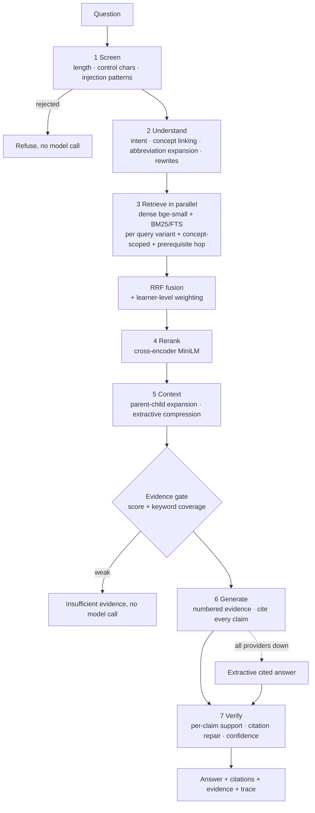

# The RAG pipeline

Code: [`backend/app/rag/`](../backend/app/rag). Measured results: [`eval/RESULTS.md`](eval/RESULTS.md)
(regenerate with `python -m backend.app.rag.evaluation --neural`).

## Ingestion

`ingest.py` → `chunking.py` → store. Markdown/text/PDF; front matter gives `id, title, domain, level,
prerequisites, tags`.

* **Normalisation** (NFKC, zero-width removal, newline collapsing) and a **content hash** per document:
  unchanged files are skipped, changed files are re-chunked and swapped in one transaction with
  `version + 1` (incremental ingestion and change detection).
* **Hierarchical chunking**: sections (parent, returned for context) → passages (≈700 chars, the retrieval
  unit). Fenced code is never split. The heading path is prefixed to the text that is embedded
  (*contextual retrieval*), so "Pitfalls" under *Binary Search* differs from "Pitfalls" under *Quick Sort*.
* **Deduplication** by normalised passage hash across documents.
* **Indirect-injection quarantine**: instruction-like spans are replaced before indexing.
* Uploads: type allow-list, 2 MB cap, UTF-8/binary/PDF-magic checks, encrypted PDFs refused; a bad file
  never aborts a batch.

## Retrieval

| Stage | What | Why |
|---|---|---|
| Query understanding | rule-based intent (definition / how-to / complexity / compare / debug / code), concept linking against document titles + tags, abbreviation expansion (BFS, DP, BST…) | free, deterministic, ~0 ms; lets a named concept always be considered |
| Multi-query | original + abbreviation-expanded + keyword + concept-grounded rewrites | recovers vocabulary mismatch; weights 1.0 / 0.6 |
| Dense | `bge-small-en-v1.5`, cosine (pgvector HNSW in Postgres) | semantic matches |
| Sparse | BM25 (SQLite FTS5) / `ts_rank_cd` over a weighted `tsvector` (Postgres GIN) | exact terms: "O(n^2)", "Kahn", "in-degree" |
| Fusion | Reciprocal Rank Fusion, k = 60 | scale-free: no calibration between cosine and BM25 |
| Learner-aware | passages above the student's level × 0.85 per level (down-weighted, never excluded) | personalised retrieval |
| Knowledge-graph hop | pulls a top passage from the *prerequisites* of the detected concept (weak ones if known) | "teach the foundation first" |
| Concurrency | independent searches run in parallel threads | the database is remote; wall time ≈ one round-trip |
| Rerank | cross-encoder scores (query, passage) jointly | fixes bi-encoder near-misses |

## Trustworthy generation

* **Grounded prompt**: only the numbered `<evidence>` may be used; every sentence ends with `[n]`;
  otherwise the model must answer `INSUFFICIENT_EVIDENCE`. Evidence is declared untrusted data and its
  delimiters are neutralised.
* **Evidence gate** (before the model): top score and query-keyword coverage must clear thresholds
  calibrated on the out-of-scope set. Refusals cost no tokens.
* **Claim verification**: each sentence is split off, checked for valid citation numbers, and scored against its
  cited evidence (or all evidence if uncited) by a blend of word/embedding overlap (65%) and an NLI entailment
  model (35%; premises can be the top passages joined). The verdict has three tiers: **supported**, **partly
  supported** (annotated, not refused) and **unsupported**. Missing citations are repaired to the best-supporting
  source; if most claims are *unsupported* the answer is withheld. The thresholds were calibrated on real
  generated answers and the verifier is a signal, not a guarantee: see [eval/verifier.md](eval/verifier.md).
* **Confidence** = f(top rerank score, mean support, citation coverage, unsupported fraction, invalid
  citations) — measured signals, never the model's self-report.
* **Degradation**: provider failover (Gemini → Groq) with cool-down; if all fail, an extractive answer
  quoted from the evidence with citations.

## Evaluation

[`evaluation.py`](../backend/app/rag/evaluation.py) + [`data/eval/questions.json`](../data/eval/questions.json)
(66 in-scope questions across direct / paraphrase / multi-concept, 10 out-of-scope, 3 injection).

* **Gold passages**: passages of the labelled document(s) containing a gold phrase — written
  independently of retrieval output; a test asserts every label resolves to a real passage.
* **Metrics**: Recall@1/3/5 (hit-rate), Precision@3, MRR, nDCG@5, p50/p95 retrieval latency.
* **Ablations**: BM25 only · dense only · hybrid RRF · + multi-query · + rerank · + prerequisite hop.
* **Gate calibration**: threshold sweep on in-scope vs out-of-scope top scores.
* `--pg` runs the same evaluation against Supabase Postgres to check store parity.

Honest notes: the corpus is small (26 documents), so absolute numbers are high; the *relative* effect of
each component is the useful result. Labels are doc/phrase based, so a correct passage that does not
contain the phrase counts as a miss (conservative). The prerequisite hop showed no measurable retrieval gain.

## Generation and verifier evaluation

* [`gen_eval.py`](../backend/app/rag/gen_eval.py): LLM-judged faithfulness, relevance, citation accuracy and
  out-of-scope refusal (generator and judge are different Mistral models). Results in [eval/generation.md](eval/generation.md).
* [`bench_perturb.py`](../backend/app/rag/bench_perturb.py), [`bench_halu.py`](../backend/app/rag/bench_halu.py),
  [`calibrate_verifier.py`](../backend/app/rag/calibrate_verifier.py): verifier benchmarks and calibration. A key
  finding is that thresholds tuned on verbatim-sentence benchmarks over-flagged real, paraphrased LLM answers
  (20% answer rate) and had to be re-calibrated on real answers.
* [`redteam_eval.py`](../backend/app/rag/redteam_eval.py): injection guard, 72% of 40 attacks blocked with zero
  false positives on 101 benign questions ([eval/redteam.md](eval/redteam.md)).
