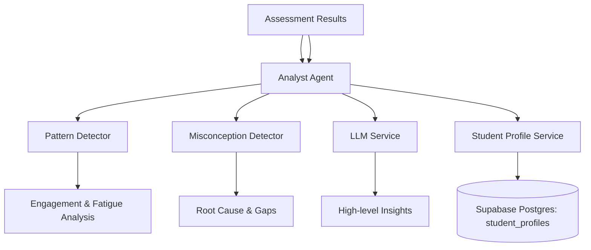

# Analyst Agent (Behavioral Analyst) 🧠📊

The Analyst Agent is responsible for transforming raw student performance and interaction data into deep pedagogical and behavioral insights. It identifies learning patterns, detects misconceptions, and predicts future performance to drive adaptive learning decisions.

## Architecture

The Analyst Agent orchestrates multiple specialized modules:

## Core Modules

### 1. Pattern Detector (`pattern_detector.py`)
- **Learning Velocity**: Calculates concepts mastered per week and identifies trends (improving, stable, declining).
- **Optimal Learning Times**: Identifies peak performance hours based on historical session data.
- **Learning Style Inference**: Detects preferences (Visual, Reading, Kinesthetic) based on engagement with different content types.
- **Fatigue Detection**: Monitors response time spikes and error rate increases within a session.

### 2. Misconception Detector (`misconception_detector.py`)
- **Categorization**: Groups errors into types like Syntax, Logic, Conceptual, or Misinterpretation.
- **Prerequisite Gap Detection**: Flags missing foundational knowledge based on assessment failure patterns.
- **Root Cause Analysis**: Uses LLM to synthesize potential reasons for repeated failures.

### 3. Analyst Agent Orchestrator (`agent.py`)
- **Session Analysis**: Coordinates modules to generate a 360-degree view of a single session.
- **Predictive Modeling**: Forecasts mastery and estimated time for upcoming concepts.
- **Longitudinal Tracking**: Analyzes progress over 30+ day windows to detect plateaus.

## API Endpoints

### 1. Analyze Session
`POST /api/v1/agents/analyst/analyze-session`
- Processes session metadata, interactions, and assessment results.
- Returns insights and "Primary Action" recommendations (Advance, Practice, Review, Break).

### 2. Predict Performance
`POST /api/v1/agents/analyst/predict-performance`
- Forecasts student success on a specific `concept_id`.
- Provides confidence scores and influencing factors.

### 3. Long-Term Progress
`GET /api/v1/agents/analyst/long-term-progress/{student_id}`
- Retrieves velocity analysis and plateau detection for a student.

## Profile Integration

The Analyst Agent updates the `StudentProfile` model (JSONB in Supabase Postgres):
- Updates `patterns` (recent_performance_trend, engagement_level).
- Informs the `Orchestrator` for next-step decisions.
- Persists mastery levels for RAG-based knowledge retrieval.
