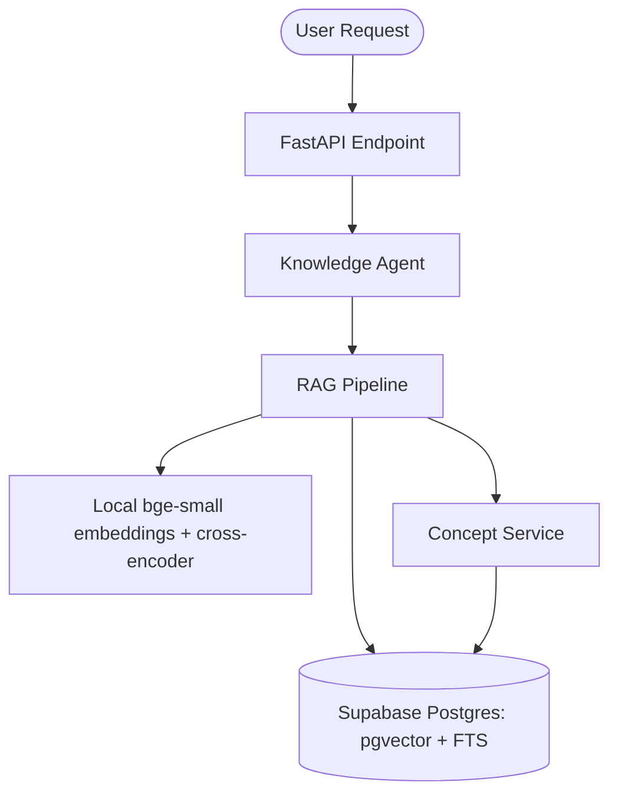

# 🤖 Knowledge Curator Agent

## Overview
The Knowledge Curator Agent is the primary content orchestration engine for the Kiddoo educational platform. It is responsible for retrieving, ranking, and adapting educational content from the curated Master Class dataset.

## Core Capabilities
- **Hybrid RAG pipeline**: multi-query dense (`bge-small`) + BM25 retrieval, RRF fusion, learner-level weighting, prerequisite hop and cross-encoder rerank over Supabase Postgres (pgvector + full-text). See [../RAG.md](../RAG.md).
- **Concept content**: derived from the same markdown corpus the RAG indexes (definition, level-based explanations, code examples, pitfalls), so there is one source of truth.
- **Pedagogical Adaptation**: Dynamically adjusts explanations and code examples based on student levels (`beginner`, `intermediate`, `advanced`).
- **Prerequisite Tracking**: Maps learning dependencies to ensure a logical curriculum flow.

## Architecture


## API Specification
### Content Retrieval
`POST /api/v1/agents/knowledge/retrieve`

**Request Body:**
```json
{
  "concept_query": "binary search",
  "student_level": "beginner",
  "context": {
    "student_id": "user_123",
    "learning_style": "visual"
  }
}
```

### Prerequisite Content
`GET /api/v1/agents/knowledge/prerequisites/{concept_id}`

## Verification Patterns
- `python -m pytest backend/app/tests/test_agents/ backend/app/tests/test_rag/test_concepts_and_knowledge_agent.py`: offline unit and integration tests.
- `python scripts/smoke_test.py`: end-to-end through the real API.
