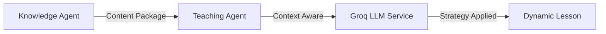

# 🤖 Teaching Agent (Adaptive Pedagogy)

## Overview
The Teaching Agent is the "Professor" of the Kiddoo system. It takes raw educational content from the Knowledge Agent and transforms it into a personalized lesson using advanced pedagogical strategies.

## Teaching Strategies
The agent dynamically selects from five primary strategies:
- **Analogy-Based**: Best for beginners or introducing new abstract concepts.
- **Visual Teaching**: Uses ASCII diagrams and structural mapping for visual learners.
- **Worked Examples**: Step-by-step problem solving for kinesthetic/hands-on learners.
- **Socratic Method**: Interactive questioning to guide the student toward discovery.
- **Incremental Complexity**: Scaffolding content from foundation to master level.

## Orchestration Logic
1. **Selection**: Analyzes student level, learning style, and interest to pick the best starting strategy.
2. **Generation**: Uses the `LLMService` (powered by **Groq**) to apply the strategy to the content.
3. **Assessment**: Automatically embeds 2-3 comprehension check questions throughout the lesson.
4. **Adaptation**: Can rewrite explanations in real-time if a student provides confusing feedback.

## Architecture


## Usage
Lessons are served via the `AgentFactory` and integrated into the learning session websocket/API.

### Sample Lesson Structure
```json
{
  "concept_title": "Binary Search",
  "teaching_strategy": "analogy",
  "lesson_content": {
    "title": "Analogy: Binary Search",
    "content": "...",
    "comprehension_checks": "..."
  }
}
```
